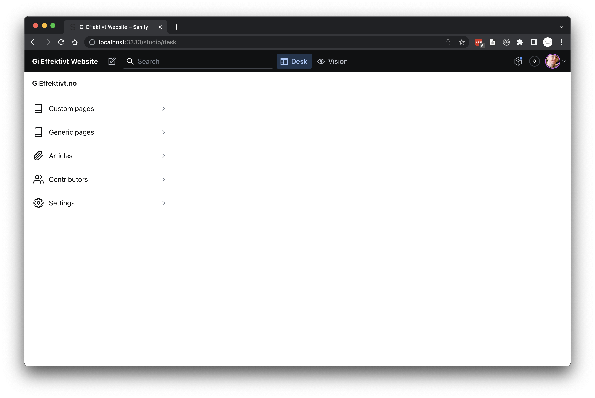

<p align="center">
  
</p>

Table of Contents
=================

* [Getting started <g-emoji class="g-emoji" alias="zap" fallback-src="https://github.githubassets.com/images/icons/emoji/unicode/26a1.png">⚡</g-emoji>](#getting-started-)
* [Project structure](#project-structure)
  * [Pages](#pages)
  * [Components](#components)
* [Sanity (Content Managment System) <g-emoji class="g-emoji" alias="book" fallback-src="https://github.githubassets.com/images/icons/emoji/unicode/1f4d6.png">📖</g-emoji>](#sanity-content-managment-system-)
* [Profile page <g-emoji class="g-emoji" alias="people_holding_hands" fallback-src="https://github.githubassets.com/images/icons/emoji/unicode/1f9d1-1f91d-1f9d1.png">🧑‍🤝‍🧑</g-emoji>](#profile-page-)
  * [Fetching and mutating data via the API](#fetching-and-mutating-data-via-the-api)
* [Build and deployment <g-emoji class="g-emoji" alias="gear" fallback-src="https://github.githubassets.com/images/icons/emoji/unicode/2699.png">⚙️</g-emoji>](#build-and-deployment-️)
* [Testing <g-emoji class="g-emoji" alias="boom" fallback-src="https://github.githubassets.com/images/icons/emoji/unicode/1f4a5.png">💥</g-emoji>](#testing-)

---

This is the repository for the main Konduit site. [Next.js](https://nextjs.org) is the react based frontend framework. It's created using a combination of static site generation for the public facing pages with [sanity.io](https://sanity.io) as the cms, as well as client side logic and data fetching on the protected profile pages.

Authentification is handled with [Auth0](https://auth0.com), and the API used for data fetching and mutation is found in the [backend repository](https://github.com/stiftelsen-effekt/effekt-backend).

<p align="center">
  
</p>

## Getting started ⚡

To get started, install the packages using npm.

``` npm install ```

To start the development server run

``` npm run dev ```

Navigating to `localhost:3000/` in your browser should yield something like this


The content managment panel is not strictly needed to run the main site. However, if you wish to use the sanity studio to change cms content, using the development data set, run 

``` npm run sanity ```

> To use the CMS you need a sanity CMS managment user. Enquire in the tech slack channel to be added as a user.

This will make sanity studio available at `localhost:3000/studio/`. It should look something like this



## Project structure

The project is structured around to major parts of the application. We have divided the site into a main part, and a profile part. This is done to reduce the payload for the users visiting the site that do not intend to log in, which is the majority of users. By seperating out the code for login and API calls, this is contained to only the users that require it.

The file `pages/_app.tsx` defines which layout that is to be used for site rendering. Each page specifies which layout to use on as a `.Layout` property on the export.

### Pages

The default Next.js router uses the folder structure of the `/pages` folder. The page will be available at the coresponding route in the application, for example `/pages/about.tsx` will be served at `/about`.

All pages under `/pages/profile` should specify the profile layout (found under `components/profile/layout.tsx`). This is beceause this layout is wrapped with the Auth0 provider, which is needed for authentification. It also uses a different navigation bar than the public facing site.

Conversely, all public facing pages should use the main layout (found under `components/main/layout.tsx`).

### Components

Reusable components not tied to a concrete page, are located in the `/components` folder. These are normal React components.

## Sanity (Content Managment System) 📖

We use Sanity as our content managment system. Sanity provides us with a nice API to fetch data when rendering statically generated content. Next uses a special function called `getStaticProps` to fetch data used for static site generation, which is then provided as props to the page in question. 

To fetch data from sanity, we make use of the [next-sanity](https://github.com/sanity-io/next-sanity) SDK To query our data in sanity, we make use of the [groq](https://www.sanity.io/docs/groq) query language.

Let's have a look at an example.

<Details>
<Summary>Example page</Summary>

```typescript
import Head from "next/head";
import { useRouter } from "next/router";
import React from "react";
import { PortableText } from "../lib/sanity";
import { getClient } from "../lib/sanity.server";
import { groq } from "next-sanity";
import { LayoutPage } from "../types";
import { Layout } from "../components/main/layout";

const ExamplePage: LayoutPage<{ data: any, preview: boolean }>  = ({ data, preview }) => {
  const router = useRouter()

  if (!router.isFallback && !data.about) {
    return <h1>404</h1>
  }

  return (
    <>
      <Head>
        <title>Konduit. - Example Page</title>
        <meta name="description" content="Konduit example page" />
        <link rel="icon" href="/favicon.ico" />
      </Head>

      <h1>Example page</h1>
      
      <PortableText blocks={data.about[0].content}></PortableText>
    </>
  )
}

export async function getStaticProps({ preview = false }) {
  const data = await getClient(preview).fetch(fetchAboutUs)

  return {
    props: {
      preview,
      data,
    },
  }
}

const fetchAboutUs = groq`
{
  "about": *[_type == "about_us"] {
    content
  }
}
`

ExamplePage.layout = Layout
export default ExamplePage
```
</Details>
<br>
In this example page, we use the publicly available main layout for the page. We fetch the data we are interested in on site generation, using the `getStaticProps` method, a sanity client and a groq query. If no data was found, we render a 404 message.

## Profile page 🧑‍🤝‍🧑

We utilize Auth0 as our identity provider. Under `components/profile/layout` we wrap the profile page with the [Auth0 react SDK](https://github.com/auth0/auth0-react) provider. When querying the [API](https://github.com/stiftelsen-effekt/effekt-backend) for data, we provide the access token from Auth0. Depending on whether the resource accessed is a protected resource, the backend API validates the token, and returns the data. The following diagram illustrates the process.

<div style="text-align: center">
  
</div>

### Fetching and mutating data via the API

For convenience, we have created a custom hook for fetching data from the API. The `useApi` hook is located under `hooks/useApi.ts`. This will a HTTP REST request **once** on the initial component mounting.

You provide the API route, method, required scopes and the auth0 SDK's getAccessTokenSilently method to the hook.

```typescript
const { getAccessTokenSilently, user } = useAuth0();

if (!user)
  // User is not logged in, handle in an apropriate way

const { loading, error, data } = useApi<Donor>(
  `/donors/${user["https://konduit.no/user-id"]}/`,
  "GET",
  "read:profile",
  getAccessTokenSilently,
);
```

> ⚠️ The donor id used for the backend API is not the same as the id of the auth0 user. The donor id used in the backend api is available on the user object as the `https://konduit.no/user-id` property.

The hook functions can be viewed as a finite state machine.


## Build and deployment ⚙️

This repository is connected to the [vercel edge cdn](https://vercel.com/). On any commit to the `main` branch, the application as automatically built, tested and deployed.

When editing content in sanity for the `production` dataset, a webhook triggers a build of the most recent version of the main branch. This generates static sites with the most recent content. Building typically takes somewhere in the range of 4 minutes.

## Testing 💥